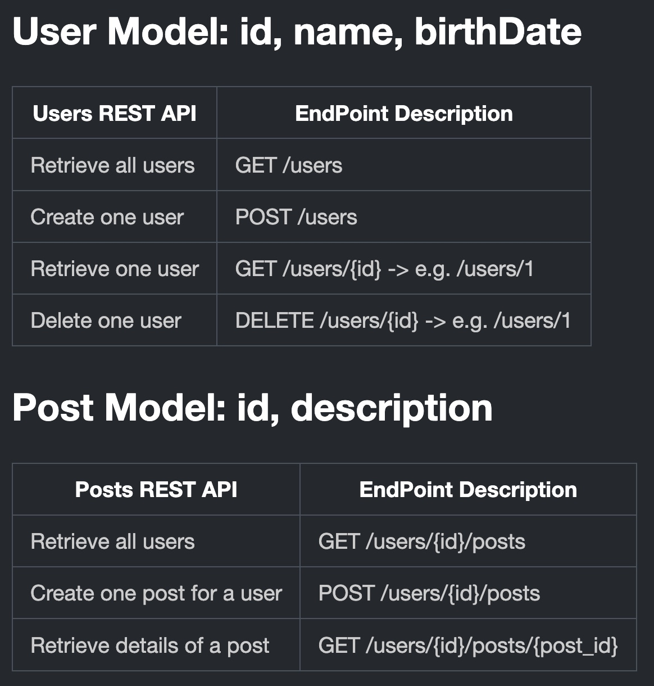
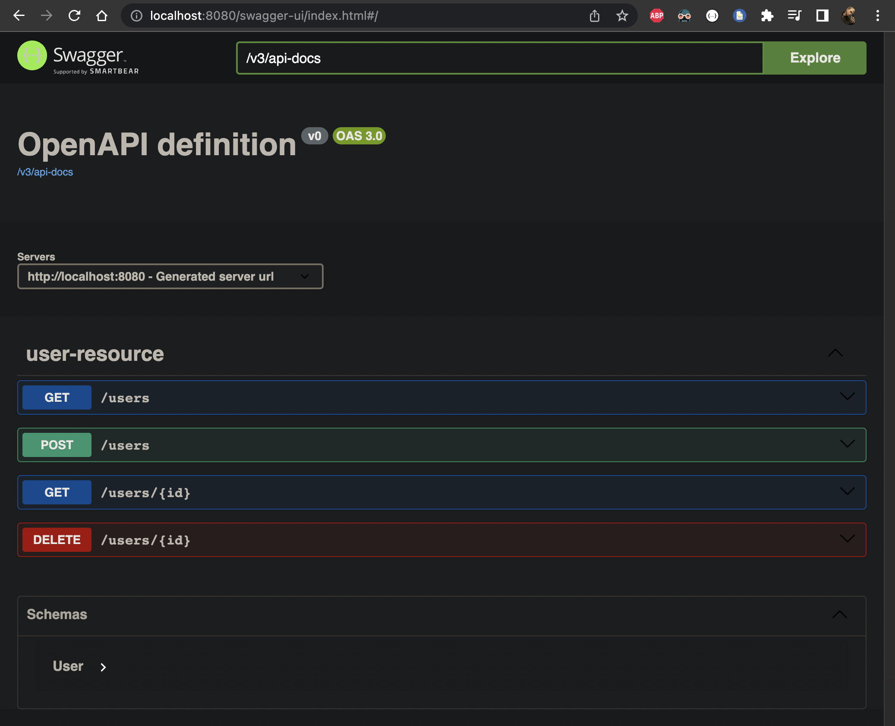
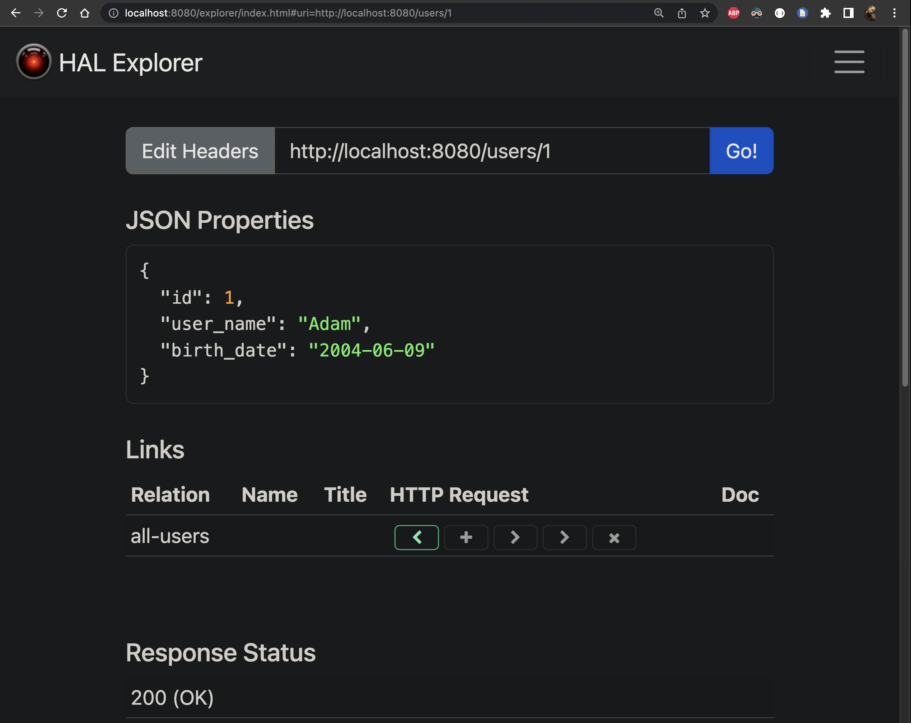

# Spring_Boot_Social_Media_RESTful_API

## User Model: id, name, birthDate

| Users REST API     | EndPoint Description                |
| ------------------ | ----------------------------------- |
| Retrieve all users | GET /users                          |
| Create one user    | POST /users                         |
| Retrieve one user  | GET /users/{id} -> e.g. /users/1    |
| Delete one user    | DELETE /users/{id} -> e.g. /users/1 |

## Post Model: id, description

| Posts REST API             | EndPoint Description            |
| -------------------------- | ------------------------------- |
| Retrieve all users         | GET /users/{id}/posts           |
| Create one post for a user | POST /users/{id}/posts          |
| Retrieve details of a post | GET /users/{id}/posts/{post_id} |

## Swagger Auto-Docs:

## HAL Explorer:

